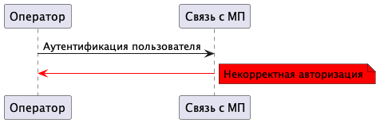
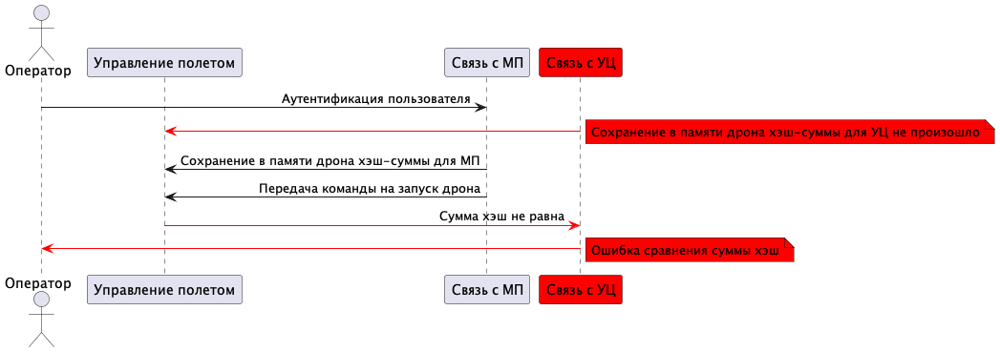
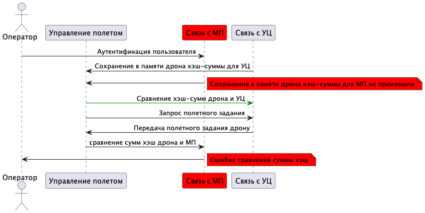
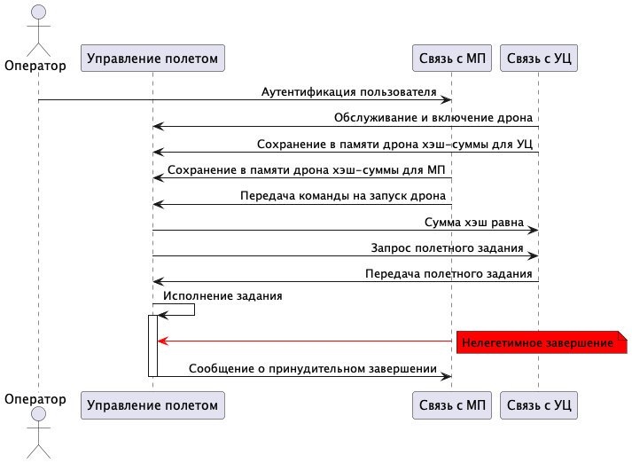
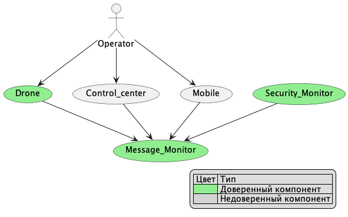

# Отчёт о выполнении задачи "Drone Atomizer"

- [Отчёт о выполнении задачи "Drone Atomizer"](#отчёт-о-выполнении-задачи-drone-atomizer)
  - [Постановка задачи](#постановка-задачи)
  - [Известные ограничения и вводные](#известные-ограничения-и-вводные)
    - [Цели и Предположения Безопасности (ЦПБ)](#цели-и-предположения-безопасности-цпб)
      - [Цели](#цели)
      - [Предположения](#предположения)
  - [Архитектура решения](#архитектура-решения)
    - [Компоненты](#компоненты)
      - [Монитор безопасности (security monitor)](#монитор-безопасности-security-monitor)
    - [Алгоритм работы решения](#алгоритм-работы-решения)
    - [Описание cценариев (последовательности выполнения операций), при которых ЦБ нарушаются\*](#описание-cценариев-последовательности-выполнения-операций-при-которых-цб-нарушаются)
      - [Негативный сценарий 1. Некорректная авторизация](#негативный-сценарий-1-некорректная-авторизация)
      - [Негативный сценарий 2. Не соответствие хэш-сумм с УЦ](#негативный-сценарий-2-не-соответствие-хэш-сумм-с-уц)
      - [Негативный сценарий 3. Не соответствие хэш-сумм с МП](#негативный-сценарий-3-не-соответствие-хэш-сумм-с-мп)
      - [Негативный сценарий 4. Мобильное приложение отправляет дрон домой до выполнения задания](#негативный-сценарий-4-мобильное-приложение-отправляет-дрон-домой-до-выполнения-задания)
      - [Сводная таблица негативных сценариев](#сводная-таблица-негативных-сценариев)
    - [Указание "доверенных компонент" на архитектурной диаграмме с обоснованием выбора](#указание-доверенных-компонент-на-архитектурной-диаграмме-с-обоснованием-выбора)
    - [Политики безопасности](#политики-безопасности)
  - [Запуск приложения и тестов](#запуск-приложения-и-тестов)
    - [Запуск приложения](#запуск-приложения)
    - [Запуск тестов](#запуск-тестов)


## Постановка задачи
Реализовать ПО дрона,мобильного приложения и управляющего центра. Разрабатываемое ПО должно считаться безопасным

## Известные ограничения и вводные

По условиям организаторов должна использоваться микросервисная архитектура и шина обмена сообщениями для реализации асинхронной работы сервисов.

### Цели и Предположения Безопасности (ЦПБ)

#### Цели

1. дрон должен выполнять только авторизованные команды
2. получение задания только от доверенного сервера
3. в случае многократных попыток неавторизованного доступа вернуться на базу
4. аутентификация компонентов - каждый модуль может работать только с теми модулями, которые прописаны в политике безопасности
5. делать снимок местности до и после распыления
6. логирование(в разработке)
7. внедрение шифрования внедрение внутреннего шифрования - против прослушки, перехвата и изменения пакетов, пересылаемых дрону(в разработке)
8.  блокировка распылителя при аварийном или принудительном возвращении домой

#### Предположения

1. не рассматриваются вопросы физической безопасности устройства
2. защита от намеренного искажения GPS-координат
3. сервис "Монитор безопасности" (SM) является полностью доверенным

## Архитектура решения
### Компоненты

| Название | Модули | Назначение | 
|----|----|----|
|*Drone* |управление полетом,GPS позиционирование,инерциальная навигация,управление распрыскивателем,контроль состояния полета,контроль обстановки| ПО дрона | 
|*MobileApp* |связь с МП| ПО для МП |
|*Control_center_connection* |связь с УЦ | центр управления дроном | 
|*Security monitor*<br>(монитор безопасности) |политика безопасности| разрешает действие,если оно удовлетворяет политике безопасности |
|*Message monitor* |  | инструмент для взаимодействия модулей|

Более подробное описание о функциях компонентов, логике их работы и методах взаимодействия см. ниже


#### Монитор безопасности (security monitor)


### Алгоритм работы решения


### Описание cценариев (последовательности выполнения операций), при которых ЦБ нарушаются*

1.  Неавторизованная команда
    1.  Включение дрона
    2.  Инициализация управления полетом
    3.  Отправка отчета о состоянии дрона в МП(дрон исправлен)
    4.  Передача неизвестной команды

2.  Запрос не от корпоративного сервера
    1.  Послать запрос не от корпоративного сервера

3.  Многократная попытка управления дроном не от авторизованного пользователя
    1.  Включение дрона
    2.  Инициализация управления полетом
    3.  Отправка отчета о состоянии дрона в МП(дрон исправлен)
    4.  Передача команды на запуск дрона
    5.  Передача полетного задания
    6.  Передача полетного задания в МП
    7.  Получение сообщения о начале полета
    8.  Послать более х(количество запросо) запросов на дрон(Дрон возвращается на базу)

4.  Аутентификация компонентов
    1.  Создать компонент(кодом)
    2.  Присвоить ему имя идентификации
    3.  Послать обращение к другому ?контейнеру?

5.  Подключение нескольких устройств к 1 дрону
6.  Негативный кейс с возвратом домой


#### Негативный сценарий 1. Некорректная авторизация



#### Негативный сценарий 2. Не соответствие хэш-сумм с УЦ



#### Негативный сценарий 3. Не соответствие хэш-сумм с МП



#### Негативный сценарий 4. Мобильное приложение отправляет дрон домой до выполнения задания




#### Сводная таблица негативных сценариев

|?  | Название | Скомпрометированная часть системы | Нарушенная цель безопасности |
|----|----|----|----|
|1 | Некорректная авторизация | Связь с МП | 1 |
|2 | Не соответствие хэш-сумм с УЦ | Связь с УЦ | 2 |
|3 | Не соответствие хэш-сумм с МП  | Связь с МП | 2 |
|4 | Мобильное приложение отправляет дрон домой до выполнения задания  | Связь с МП | 8 |

### Указание "доверенных компонент" на архитектурной диаграмме с обоснованием выбора



### Политики безопасности


```python {lineNo:true}

def check_operation(id, details):
    authorized = False
    src = details['source']
    dst = details['deliver_to']
    operation = details['operation']
    if  src == 'downloader' and dst == 'manager' \
        and operation == 'download_done':
        authorized = True   
    if src == 'manager' and dst == 'downloader' \
        and operation == 'download_file':
        authorized = True   
    if src == 'manager' and dst == 'storage' \
        and operation == 'commit_blob':
        authorized = True   
    if src == 'manager' and dst == 'verifier' \
        and operation == 'verification_requested':
        authorized = True   
    if src == 'verifier' and dst == 'manager' \
        and operation == 'handle_verification_result':
        authorized = True   
    if src == 'manager' and dst == 'updater' \
        and operation == 'proceed_with_update' \
        and details['verified'] is True:
        authorized = True   
    if src == 'storage' and dst == 'manager' \
        and operation == 'blob_committed':
        authorized = True   
    if src == 'verifier' and dst == 'storage' \
        and operation == 'get_blob':
        authorized = True
    if src == 'storage' and dst == 'verifier' \
        and operation == 'blob_content':
        authorized = True   
    if src == 'updater' and dst == 'storage' \
        and operation == 'get_blob':
        authorized = True
    if src == 'storage' and dst == 'updater' \
        and operation == 'blob_content':
        authorized = True   
     
    return authorized

```

## Запуск приложения и тестов


### Запуск приложения

см. [инструкцию по запуску](../../README.md)

### Запуск тестов

